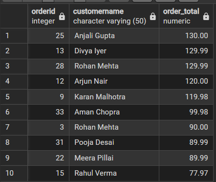
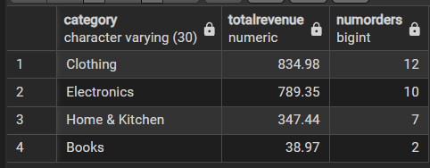
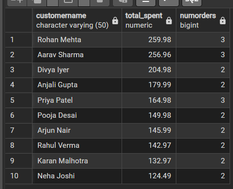
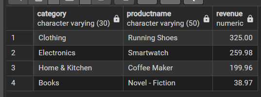
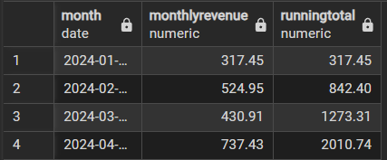
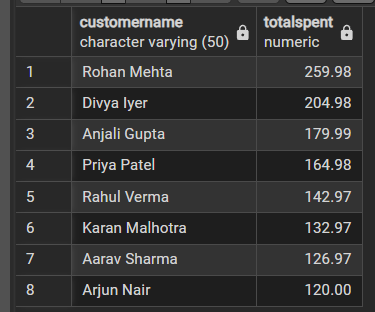
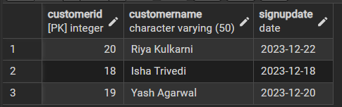
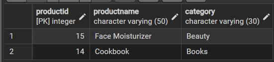
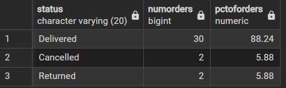

# E-Commerce SQL Analysis

## Business Context
This project is a self-designed e-commerce SQL case study, built to practice 
the full analyst workflow — schema design, realistic sample data, and 
business-driven queries (joins, window functions, subqueries, CTEs). Using a 
3-table database (Customers, Products, Orders), I answered practical questions 
like which products and customers drive the most revenue, which show no 
activity, and how order fulfillment is trending — then translated the results 
into clear insights.

## Tech Stack
- PostgreSQL (pgAdmin)


## Business Questions & Analysis

### 1. What are our highest-value orders?
```sql
SELECT o.OrderID, c.CustomerName, SUM(o.Quantity * p.Price) AS OrderTotal
FROM Orders o
JOIN Customers c ON o.CustomerID = c.CustomerID
JOIN Products p ON o.ProductID = p.ProductID
WHERE o.Status = 'Delivered'
GROUP BY o.OrderID, c.CustomerName
ORDER BY OrderTotal DESC
LIMIT 10;
```


**Insight:** The highest-value order (Order #25) totaled ₹130, driven by a bulk purchase of Running Shoes.

---

### 2. Which product category generates the most revenue?
```sql
SELECT p.Category, SUM(o.Quantity * p.Price) AS TotalRevenue, COUNT(DISTINCT o.OrderID) AS NumOrders
FROM Orders o
JOIN Products p ON o.ProductID = p.ProductID
WHERE o.Status = 'Delivered'
GROUP BY p.Category
ORDER BY TotalRevenue DESC;
```


**Insight:** Clothing is the top-performing category, generating ₹834.98 across 12 orders — narrowly ahead of Electronics (₹789.35, 10 orders).

---

### 3. Who are our highest-value customers?
```sql
SELECT c.CustomerName, SUM(o.Quantity * p.Price) AS TotalSpent, COUNT(DISTINCT o.OrderID) AS NumOrders
FROM Orders o
JOIN Customers c ON o.CustomerID = c.CustomerID
JOIN Products p ON o.ProductID = p.ProductID
WHERE o.Status = 'Delivered'
GROUP BY c.CustomerName
ORDER BY TotalSpent DESC
LIMIT 5;
```


**Insight:** Rohan Mehta is the top-spending customer at ₹259.98 across 3 orders.

---

### 4. What's the best-selling product in each category?
```sql
WITH ProductRevenue AS (
    SELECT p.Category, p.ProductName, SUM(o.Quantity * p.Price) AS Revenue
    FROM Orders o
    JOIN Products p ON o.ProductID = p.ProductID
    WHERE o.Status = 'Delivered'
    GROUP BY p.Category, p.ProductName
),
RankedProducts AS (
    SELECT Category, ProductName, Revenue,
        DENSE_RANK() OVER (PARTITION BY Category ORDER BY Revenue DESC) AS CategoryRank
    FROM ProductRevenue
)
SELECT Category, ProductName, Revenue
FROM RankedProducts
WHERE CategoryRank = 1
ORDER BY Category;
```


**Insight:** Running Shoes is the top-selling product overall by revenue (₹325), even outperforming the Smartwatch (₹259.98).

---

### 5. How is revenue trending month over month?
```sql
SELECT DATE_TRUNC('month', o.OrderDate)::DATE AS Month,
    SUM(o.Quantity * p.Price) AS MonthlyRevenue,
    SUM(SUM(o.Quantity * p.Price)) OVER (ORDER BY DATE_TRUNC('month', o.OrderDate)) AS RunningTotal
FROM Orders o
JOIN Products p ON o.ProductID = p.ProductID
WHERE o.Status = 'Delivered'
GROUP BY DATE_TRUNC('month', o.OrderDate)
ORDER BY Month;
```


**Insight:** Monthly revenue grew from ₹317.45 in January to ₹737.43 in April, reaching a cumulative ₹2,010.74.

---

### 6. Which customers are above-average spenders?
```sql
SELECT c.CustomerName, SUM(o.Quantity * p.Price) AS TotalSpent
FROM Orders o
JOIN Customers c ON o.CustomerID = c.CustomerID
JOIN Products p ON o.ProductID = p.ProductID
WHERE o.Status = 'Delivered'
GROUP BY c.CustomerName
HAVING SUM(o.Quantity * p.Price) > (
    SELECT AVG(CustomerTotal) FROM (
        SELECT SUM(o2.Quantity * p2.Price) AS CustomerTotal
        FROM Orders o2
        JOIN Products p2 ON o2.ProductID = p2.ProductID
        WHERE o2.Status = 'Delivered'
        GROUP BY o2.CustomerID
    ) sub
)
ORDER BY TotalSpent DESC;
```


**Insight:** 8 customers spent above the average order value, led by Rohan Mehta (₹259.98) and Divya Iyer (₹204.98).

---

### 7. Which customers have never placed an order?
```sql
SELECT c.CustomerID, c.CustomerName, c.SignupDate
FROM Customers c
LEFT JOIN Orders o ON c.CustomerID = o.CustomerID
WHERE o.OrderID IS NULL;
```


**Insight:** 3 of 20 customers (15%) never ordered — all signed up in mid-to-late December, suggesting a possible onboarding gap.

---

### 8. Which products have zero sales?
```sql
SELECT p.ProductID, p.ProductName, p.Category
FROM Products p
LEFT JOIN Orders o ON p.ProductID = o.ProductID
WHERE o.OrderID IS NULL;
```


**Insight:** 2 of 15 products (13%) never sold — Cookbook and Face Moisturizer, candidates for promotion or catalog review.

---

### 9. What percentage of orders are cancelled or returned?
```sql
SELECT Status, COUNT(DISTINCT OrderID) AS NumOrders,
    ROUND(100.0 * COUNT(DISTINCT OrderID) / SUM(COUNT(DISTINCT OrderID)) OVER (), 2) AS PctOfOrders
FROM Orders
GROUP BY Status
ORDER BY NumOrders DESC;
```


**Insight:** 88.24% of orders were delivered successfully; cancellations and returns each account for 5.88%.

---

## Key Insights & Recommendations
1. Electronics leads category revenue, but Running Shoes (Clothing) is the single best-selling product — revenue leadership comes from product breadth, not one item.
2. 8 customers (above-average spenders) are strong candidates for a loyalty program.
3. 15% of customers have never ordered, all recent signups — worth investigating onboarding.
4. 13% of products have zero sales — Cookbook and Face Moisturizer should be reviewed for promotion or removal.
5. Fulfillment is largely healthy (88% delivered), with a combined 12% cancellation/return rate worth monitoring.

## Files in this Repository
- `schema.sql` — table creation statements
- `sample_data.sql` — sample data (20 customers, 15 products, 40 order line items)
- `analysis_queries.sql` — all 9 business analysis queries
- `screenshots/` — query output screenshots
